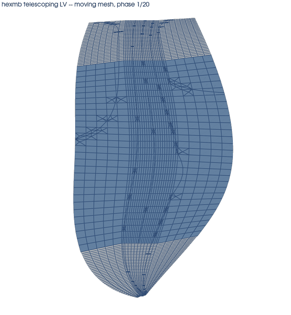
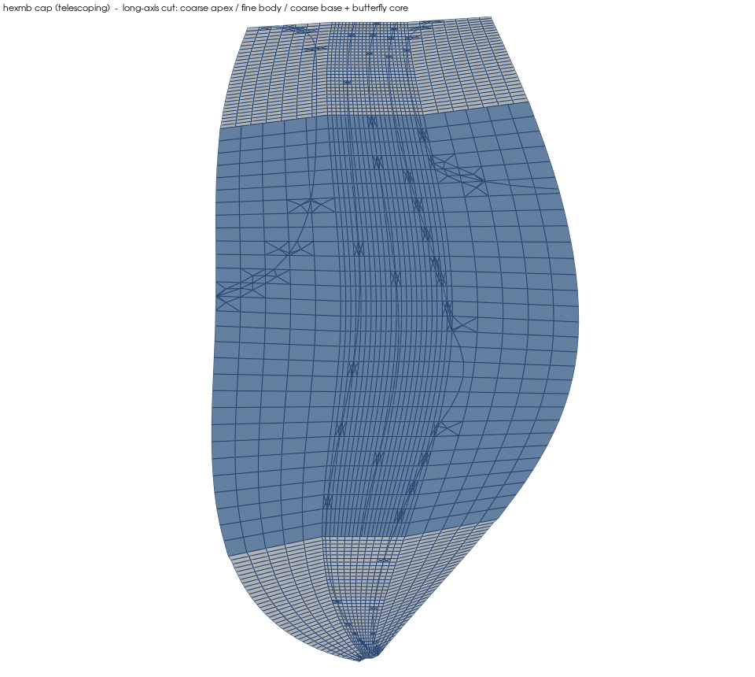
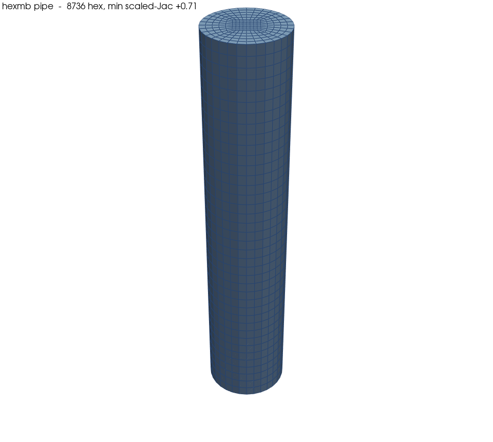
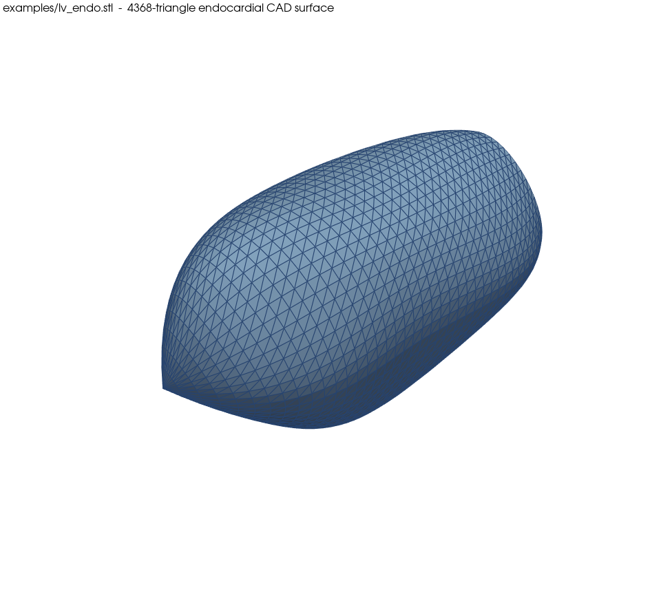

# hexmb — structured O-grid hex mesher

`hexmb` builds all-hexahedral **O-grid (butterfly)** meshes for CFD and writes
them directly as an OpenFOAM `constant/polyMesh`. An O-grid is a square "H" core
block surrounded by boundary-fitted petal blocks — all-hex, boundary-conforming,
and with **no singular polar axis**, so it can be morphed as one iso-topological
mesh through large deformation (e.g. a beating heart chamber) without remeshing.

**hexmb is the mesher: you give it a surface, it gives you the hex mesh.** The
surface can be an ordered ring grid `(stations, angle, 3)` or a tubular STL —
from any segmentation, whoever produced it. The same operation (`sweep a
butterfly section along a stack of rings`) builds a straight pipe, a U-bend, a
tapered vessel, and a left-ventricle cavity.

The worked example ships with a reader for **public-domain** left-ventricle
geometry (Cardiac Atlas Project — Sunnybrook Cardiac Data, CC0), so the whole
pipeline is reproducible with no private data. See [`docs/DATA.md`](docs/DATA.md).

## What it produces

<p align="center">
  
  
</p>
<p align="center">
  
  
</p>

<p align="center"><em>Left to right, top to bottom: the telescoping LV mesh morphing through the 20 CAP
cardiac phases (one iso-topological mesh, no remeshing); its long-axis cut (coarse apex / fine body /
coarse base + butterfly core); a pipe O-grid (note the butterfly core cap, no polar axis); and the
endocardial CAD surface the mesh is built from. All in <a href="examples/">examples/</a>.</em></p>

## What it does, and where each part stands

| Track | What it does | Status |
|---|---|---|
| **Engine** — swept tubes + single chamber | O-grid meshes for a pipe, bend, tapered/STL vessel, or a heart chamber; near-wall boundary layers; whole-cycle morph by transfinite-interpolation resurfacing | **Validated.** `checkMesh`-clean; the LV morphs across the cardiac cycle with 0 inverted cells; assembly vectorised to millions of cells. |
| **Telescoping LV** — multi-resolution | Coarse apex cap + fine body + coarse base cap as three zones joined by non-conformal AMI couplings, so the body scales to ~1M cells while the caps stay under the apex-pinch limit | **Working.** Body meshes to ~1M cells `checkMesh`-clean; assembly needs OpenFOAM (`mergeMeshes` + `createNonConformalCouples`). |

Branches, junctions, and multi-branch trees are **out of scope** — conforming
meshing through a junction is unsolved here.

## Install

Use a virtual environment (recommended — modern Linux blocks `pip` into the system
Python):

```bash
cd ~/GitHub/hexmb
python3 -m venv .venv && source .venv/bin/activate
pip install -e .                 # core needs only numpy
pip install -e ".[scipy,dev]"    # + scipy (CAP reader, faster assembly) and pytest
```

This puts a `hexmb` command on your PATH. Mesh generation is pure Python (numpy;
scipy for the CAP reader). OpenFOAM 12 is only needed to run `checkMesh`, assemble
the telescoping AMI couplings, or run a solver on the output.

(If you would rather not use a venv, `pip install -e . --break-system-packages`
works too, at the usual risk of touching the system Python.)

## Quick start

Every command prints a quality line and says what it wrote. The outputs shown
below are the real results of running each command.

**1. A pipe — needs no data, works right after install.**

```bash
hexmb pipe --length 100 --radius 10 -o case_pipe
```
```text
  cells 8736  points 9640  min scaled-Jac +0.7071  median +0.991  inverted 0  (VALID)
  wrote case_pipe/constant/polyMesh  (nFaces 27056, patches ['outlet', 'inlet', 'wall'])
```
Creates an OpenFOAM case you can open in ParaView or run:
`case_pipe/constant/polyMesh/` (`points faces owner neighbour boundary`) and a
minimal `case_pipe/system/controlDict`.

**2. A U-bend.**

```bash
hexmb elbow --radius 10 --bend-radius 35 --angle 180 -o case_ubend
```
```text
  cells 15904  points 17352  min scaled-Jac +0.7065  median +0.990  inverted 0  (VALID)
  wrote case_ubend/constant/polyMesh  (nFaces 49072, patches ['outlet', 'inlet', 'wall'])
```
Creates `case_ubend/constant/polyMesh/` (same file set).

**3. Check a mesh you built (needs OpenFOAM 12 for `checkMesh`).**

```bash
hexmb verify -o case_pipe
```
```text
  readback: 9640 pts, owner<neighbour OK, max |sum Sf| per cell 1.69e-21
  [checkMesh] hexahedra:     8736
  [checkMesh] Min volume = 1.41346e-09. ... Cell volumes OK.
  [checkMesh] Mesh non-orthogonality Max: 24.49 average: 6.37
  [checkMesh] Max skewness = 0.434526 OK.
  [checkMesh] Mesh OK.
```
Writes nothing; reads the case back and runs `checkMesh` (without OpenFOAM it does
the readback and skips `checkMesh` with a note).

**4. The public LV demo — download a CAP model first (see [`docs/DATA.md`](docs/DATA.md)).**

```bash
python scripts/cap_to_mesh.py /path/to/SCD0000101_1.model.exnode -o out/lv --stl out/lv_endo.stl
```
```text
[1] read CAP model: .../SCD0000101_1.model.exnode
    endocardial surface (40, 56, 3)  mid-radius ~28 mm
[2] wrote CAD surface: out/lv_endo.stl  (4368 triangles, mm)
[3] mesh with hexmb (telescoping: coarse apex / fine body / coarse base)
    zone apex :    12617 cells  min scaled-Jac +0.391  (valid)
    zone body :    26796 cells  min scaled-Jac +0.612  (valid)
    zone base :    31900 cells  min scaled-Jac +0.616  (valid)
[4] wrote telescoping polyMesh under out/lv  (AMI-coupled)
```
Creates: **`out/lv_endo.stl`** — the endocardial surface as a CAD file (open in any
viewer); and **`out/lv/`** — the telescoping case, three zone meshes
`out/lv/{apex,body,base}/`, with `out/lv/apex/` the merged master carrying the AMI
couplings (open `out/lv/apex` in ParaView). `hexmb cap --exnode … -o out/lv --stl
out/lv_endo.stl` produces exactly the same thing from the CLI.

**5. The same from Python — a built-in template.**

```python
from hexmb.templates.tube import PipeTemplate
m = PipeTemplate(length=100, radius=10, NT=32, NR=6).build()
print(m.scaled_jacobian().min())          # -> 0.7071  (> 0 => valid, all cells)
m.write_polymesh("case_pipe/constant/polyMesh")   # writes the polyMesh files
```

**6. Bring your own surface** — the CAP reader is one provider; any ordered
`(NL, NT, 3)` ring grid works the same way.

```python
from hexmb.io.cap import cap_endo_surface, surface_frame
from hexmb.templates.lv import LVChamberTemplate
G = cap_endo_surface("SCD0000101_1.model.exnode")   # or your own (NL, NT, 3) surface array
axis, e1, e2, mu = surface_frame(G)                 # or supply your own base frame
m = LVChamberTemplate(G, axis, e1, e2, NR=6, core_frac=0.35).build()
m.write_polymesh("out/lv/constant/polyMesh")        # patches: wall / inlet / outlet1
```

A single O-grid over a whole LV inverts a few cells at the valve plane; for a
morphing or high-resolution LV use the telescoping template — `hexmb cap` (step 4)
does this by default.

## How to test a geometry (the verify pipeline)

1. Build a `MultiBlockMesh` from a template.
2. **Quality gate**: `m.scaled_jacobian().min() > 0` (no inverted cells). Target > 0.2.
3. **Export**: `m.write_polymesh(<case>/constant/polyMesh)`.
4. **Verify**: `hexmb verify -o <case>` — checks `owner < neighbour`, closed cells
   (Σ face-area ≈ 0), and runs `checkMesh`.
5. **Pass condition**: `checkMesh` reports **zero negative-volume cells** (the hard
   gate). "Mesh OK" is ideal; a few skewness warnings are non-fatal.

Worked results (`tests/`): pipe and U-bend → `Mesh OK`, min scaled-Jac ≈ 0.71;
LV cavity → 0 inverted cells across a full cardiac cycle.

### Run the test suite

```bash
python -m pytest tests/ -q
```
```text
...................                                                      [100%]
19 passed in 9.9s
```

The suite is self-contained (no data files): `core` (node dedup, TFI, million-cell
assembly), `tubes` (`wall_ratio` boundary layer, scaling), `ogrid_lv` and
`telescoping_lv` (LV templates on a synthetic prolate-spheroid cavity), and `ami`
(guard tests for the non-conformal AMI assembler's public API).

## Conditions of use (applicability domain)

`hexmb` applies to a geometry that is **one connected lumen describable as a stack
of cross-sections swept along a centreline**. Concretely, use it when:

1. **Topology** — a single-lumen **tube** (two open ends) or a **sac** (one open
   end + a closed cap, like the LV). Genus 0, one connected region.
2. **Description** — the geometry is available as either
   - a structured surface grid `G[station, angle]` (shape `(ns, NT, 3)`), or
   - a centreline path + radius (circular sections) via `sweep_ogrid`.
   `NT` (points around the section) must be **divisible by 4**.
3. **Cross-sections are star-shaped about their centre** — every boundary point is
   visible from the section centroid, so the petals do not fold. Mild non-convexity
   is fine (the LV base is); strongly re-entrant sections are not.
4. **Gentle bends** — the rotation-minimizing frame handles curved centrelines, but
   a bend radius smaller than the tube radius distorts the inner cells (a limit of
   any structured O-grid sweep).
5. **Ends → patches** — each open end becomes one patch; a closed cap becomes wall.
   A single cap can be sub-partitioned into several orifices by an angular predicate
   (the LV base cap → `inlet` mitral / `outlet1` aortic / `wall` annulus).
6. **Moving meshes** — supply a displacement field or a moved surface per phase. The
   morph stays valid while the moved surface stays star-shaped and non-self-
   intersecting; large deformation uses the *resurface* strategy (move the surface,
   refill the interior by transfinite interpolation).

**Out of scope.** These produce no single conforming, flow-verified domain here:
- Branches / bifurcations / junctions (Y, T) and multi-branch trees.
- Multi-lumen geometries; arbitrary genus (holes/handles).
- Sharp features/corners that must stay crisp (the O-grid is smooth boundary-fitted).

## Telescoping refinement (multi-resolution LV)

To give one LV mesh two resolutions — a fine body where the flow needs it, coarse
caps at the closing apex and valve plane — `hexmb.templates.telescoping_lv` builds
three zones (apex / body / base) and joins them by **non-conformal AMI** couplings.
The body scales to ~1M cells while the caps stay under the apex-pinch limit (a
single O-grid over the whole cavity inverts past ~50 cells across at end-systole).

```python
from hexmb.templates.telescoping_lv import (
    TelescopingLVConfig, build_telescoping_lv, assemble_telescoping_lv,
)
cfg = TelescopingLVConfig(body_NT=340, body_NR=24)     # the ~1M configuration
zones = build_telescoping_lv(G, axis, e1, e2, cfg, mu=mu)
assemble_telescoping_lv(zones, "out/lv", cfg)          # merge + AMI couple (needs OpenFOAM)
```

`TelescopingLVConfig` also carries the valve-plane fixes (Fourier de-spike of the
noisy annulus, base cut at the annulus rather than the flared tip). Assembly shells
out to OpenFOAM's `mergeMeshes` and `createNonConformalCouples`, so this path needs
OpenFOAM 12 on `PATH`; the per-zone numpy build and quality gate do not.

## Architecture

```
core/       Block, MultiBlockMesh (union-find node dedup), topology, tfi3d (Coons)
assembly/   ogrid (5-block butterfly + 8 joins), sweep (frames, rings), ami (non-conformal AMI assembler)
services/   quality (scaled-Jacobian), export_foam (polyMesh), smooth, morph (RBF)
io/         cap (CAP .exnode -> endocardial surface), stl_surface (surface grid -> STL/CAD)
templates/  tube (pipe/elbow), stl (STL tube), lv (single-region chamber), telescoping_lv (multi-resolution LV)
cli.py      hexmb pipe | elbow | cap | lv | stl | verify
```

See [`docs/METHODS.md`](docs/METHODS.md) for the formal method description
(O-grid, sweep, morph, apex ceiling, and the AMI telescoping assembly).

The block cell order matches the scaled-Jacobian gate and the OpenFOAM face
template; faces are oriented geometrically (outward from the cell centroid), so
export is correct regardless of a block's index handedness. Shared block faces are
merged topologically (union-find) and verified by coordinate coincidence.

## Scale

Node deduplication / assembly is vectorised via connected components (SciPy
`csgraph`, with a numpy fallback), so it builds **millions of cells** fast —
≈1.2 M hex in ~2 s and ≈4 M hex in ~9 s on one core (a boundary-layer straight
pipe, 0 inverted). The per-geometry ceiling still applies (the LV apex, ~50
across), which is what the telescoping template is for.

## Roadmap

Conforming junction/bifurcation meshing; a richer boundary-layer API (explicit
first-cell height / y⁺ / n-layers on top of the `wall_ratio` grading); elliptic
(Winslow) interior smoother; built-in mesh metrics (skewness, non-orthogonality,
aspect ratio).

MIT-licensed (see `LICENSE`).
